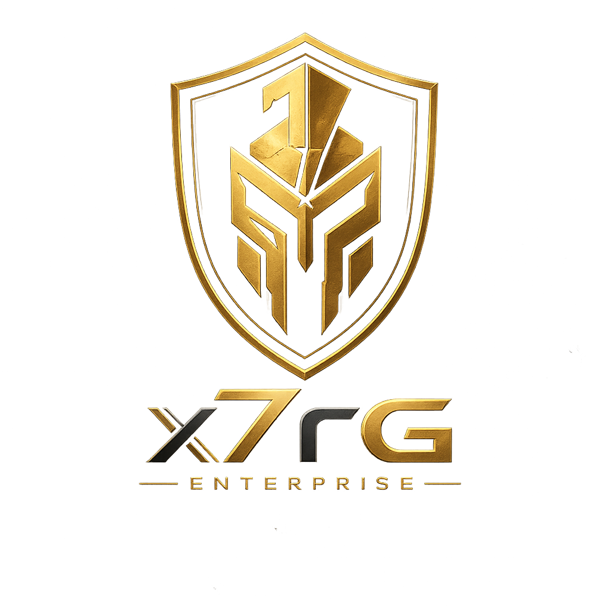
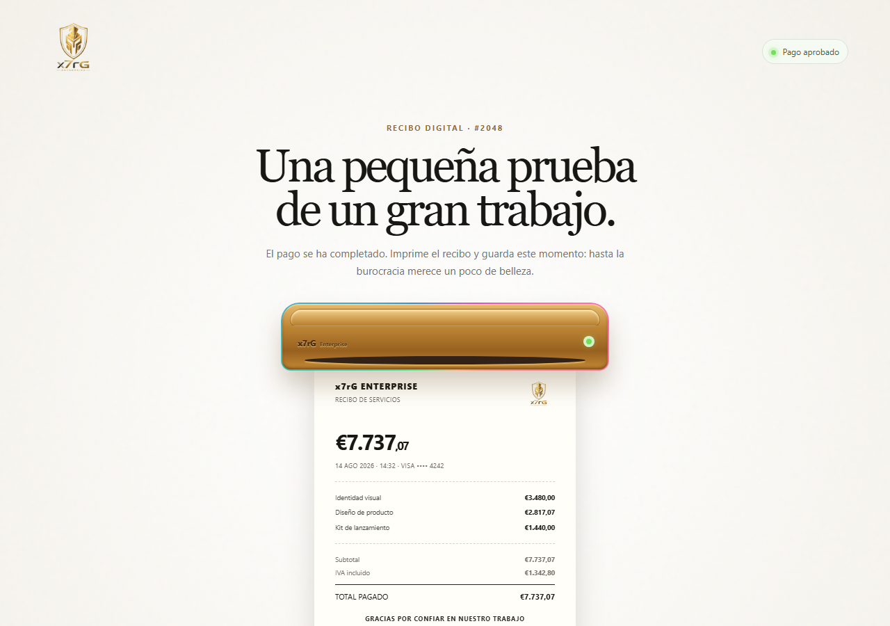
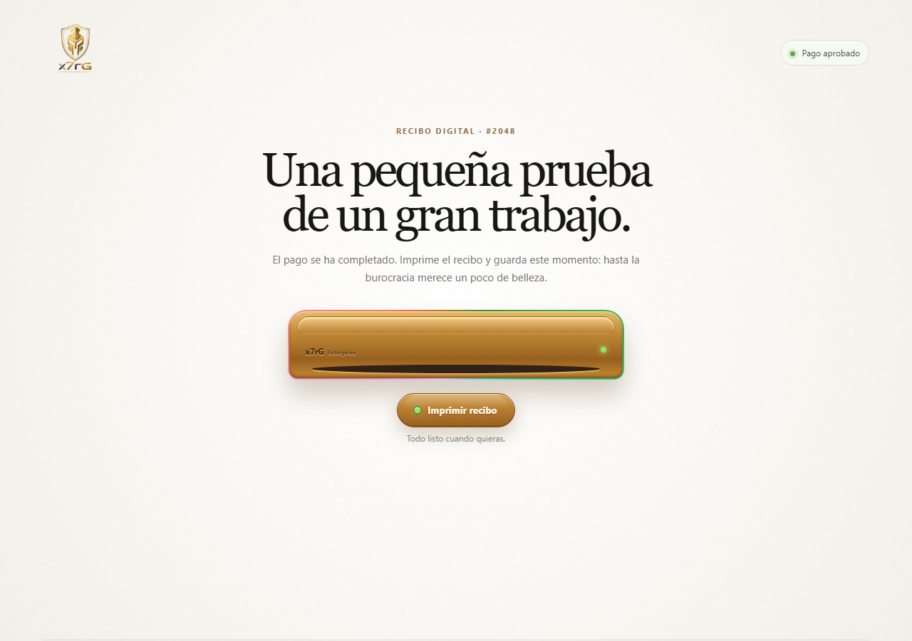
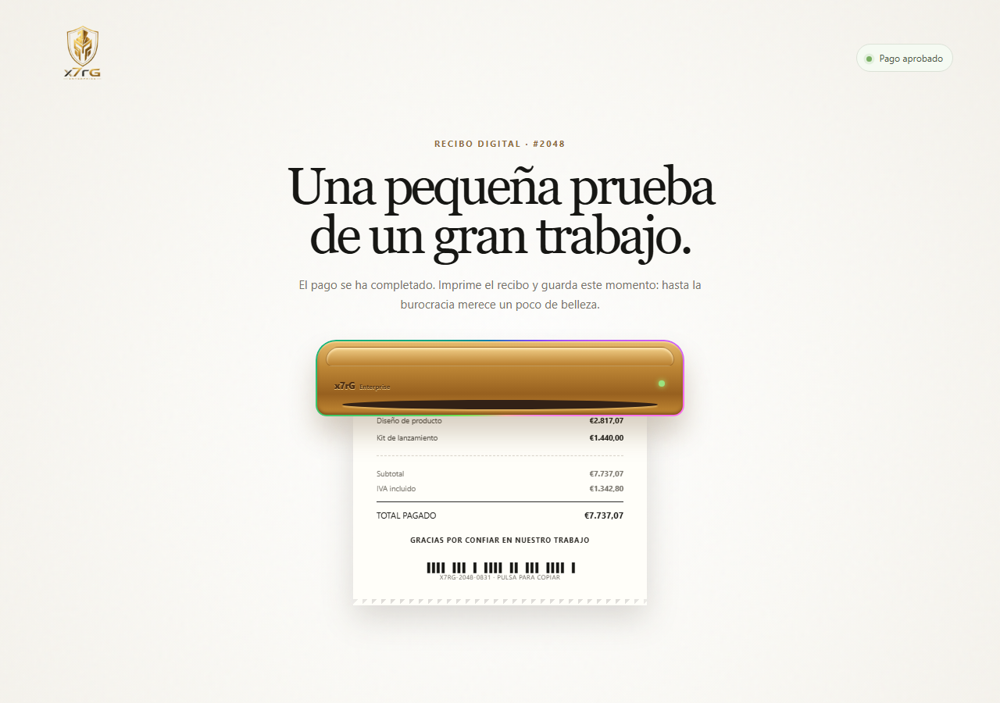
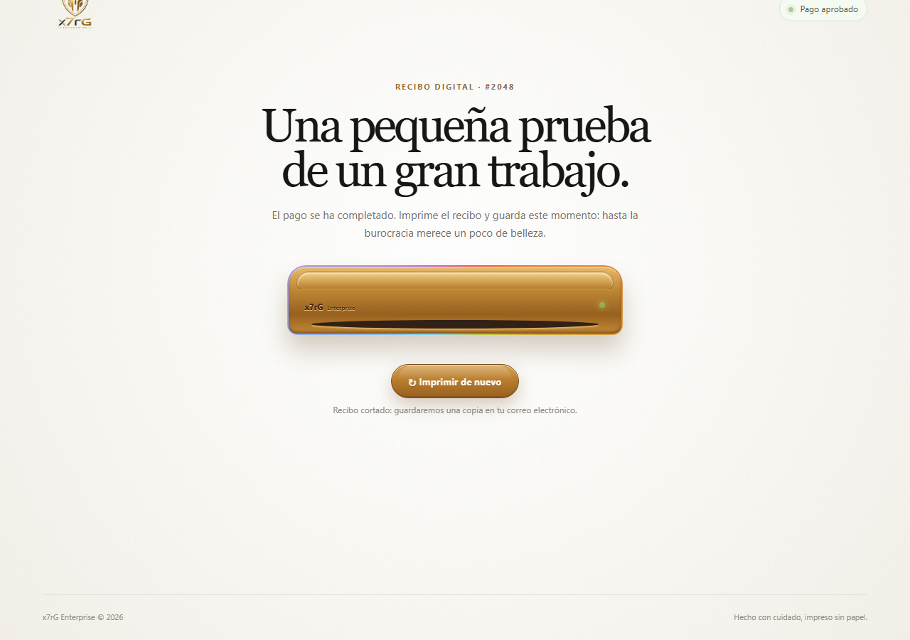
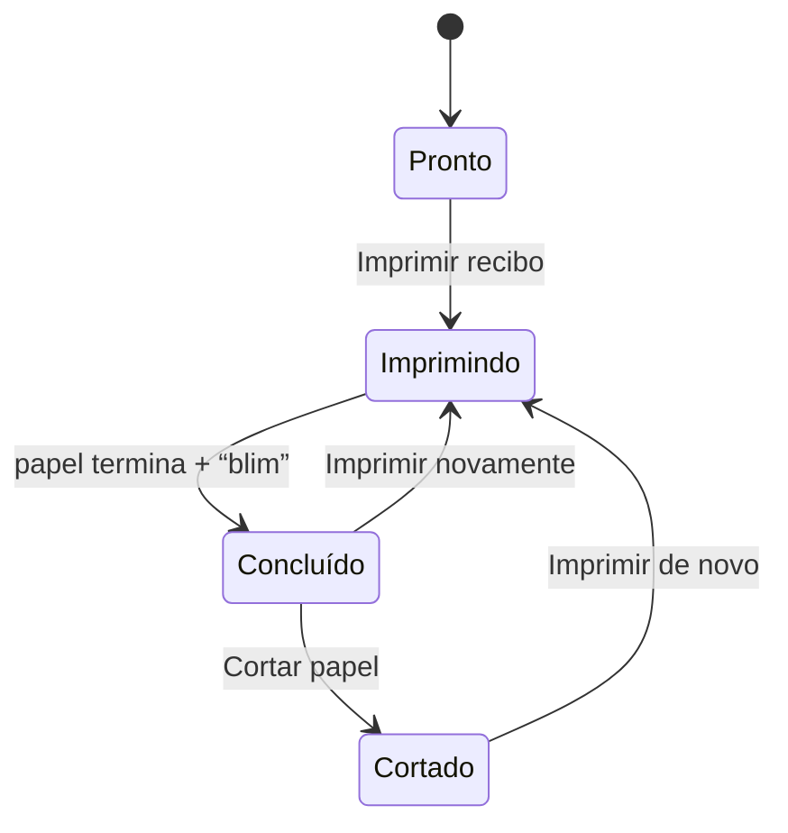
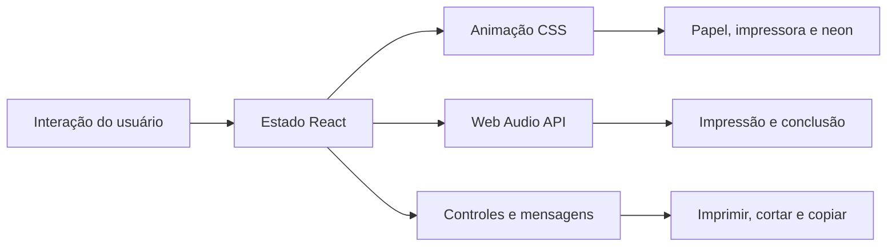
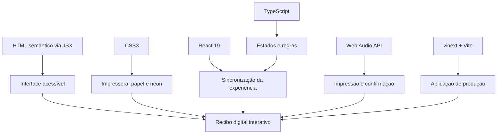

<div align="center">



# Digital Receipt Experience - x7rG Enterprise

### Quando até um recibo deixa de ser burocracia e passa a ser experiência.

Uma interface interativa que transforma a confirmação de pagamento em um momento de marca: impressão simulada, movimento do papel, luz, som e acabamento premium — tudo dentro do navegador.

[Ver experiência publicada](https://x7rg-enterprise-recibo-digital.contato-rgsantos.workers.dev) · [Instalação](#executar-localmente) · [Arquitetura](#arquitetura-do-projeto) · [Documentação completa](docs/APRESENTACAO.md)

</div>



## Mais do que imitar uma impressora

O projeto nasceu de uma pergunta simples: **por que uma confirmação digital precisa ser fria e descartável?**

Em vez de reproduzir apenas a aparência de um comprovante, esta experiência recria o ritual da impressão. O usuário aciona a máquina, ouve o mecanismo, acompanha o papel surgindo pela abertura, recebe uma confirmação sonora e decide entre cortar ou imprimir novamente. Cada detalhe comunica conclusão, confiança e cuidado.

O resultado combina o familiar — uma impressora térmica — com uma interação contemporânea, responsiva e sem consumo obrigatório de papel.

## Experiência e responsabilidade ambiental

Recibos térmicos têm vida útil curta: muitas vezes são impressos, consultados uma vez e descartados. Uma experiência digital bem projetada pode preservar a sensação de conclusão de uma compra sem exigir uma impressão física para cada operação.

Este projeto propõe:

- reduzir impressões desnecessárias quando o comprovante digital é suficiente;
- manter a informação legível e disponível na tela;
- tornar o recibo digital mais memorável e confiável;
- mostrar que sustentabilidade também pode ser trabalhada por meio de design e experiência;
- criar uma base para armazenamento, compartilhamento ou envio eletrônico em futuras versões.

> A interface não calcula economia ambiental automaticamente. O benefício ocorre quando a experiência digital substitui, de fato, a emissão de um recibo físico.

## Identidade x7rG Enterprise

<div align="center">
  
</div>

A direção visual combina dourado, marfim, preto e verde. O dourado reforça o caráter premium; o marfim remete ao papel; o verde comunica aprovação e continuidade; o neon RGB acrescenta tecnologia sem alterar a cor do equipamento.

## Capturas de tela

| Pronto para imprimir | Imprimindo | Recibo cortado |
|---|---|---|
|  |  |  |

Mais detalhes e contexto de cada estado em [docs/APRESENTACAO.md](docs/APRESENTACAO.md).

## Recursos principais

- Saída progressiva do recibo pela abertura da impressora.
- Máquina com volume, reflexos, profundidade e acabamento metálico.
- Neon RGB contornando as bordas do equipamento.
- Som mecânico sincronizado com o início da impressão.
- Sinal sonoro de conclusão no momento exato em que o papel termina de sair.
- Indicadores verdes sincronizados entre a página e a impressora.
- Estados de imprimir, processar, cortar e imprimir novamente.
- Número do recibo copiável para a área de transferência com um toque.
- Recibo integralmente legível em espanhol da Espanha.
- Código visual de barras com ação para copiar o identificador.
- Interface responsiva para desktop, Android e iPhone.
- Otimizações específicas para Safari e Chrome no iOS.
- Navegação por teclado, foco visível e regiões com atualização acessível.

## Fluxo da interação



O estado da interface controla simultaneamente o papel, a posição dos botões, os textos auxiliares, o neon, os LEDs e o áudio. Isso evita animações independentes e mantém a experiência coerente.

## Arquitetura do projeto



### Camada de interface

`app/page.tsx` concentra o componente principal, os dados do recibo, a máquina de estados e os acionamentos de áudio. A estrutura visual é escrita em JSX, que produz HTML semântico no navegador.

### Camada visual

`app/globals.css` controla composição, tipografia, responsividade, profundidade, neon e animações. O papel utiliza transformações 3D aceleradas por GPU para manter o movimento estável em navegadores baseados em WebKit, especialmente no iPhone.

### Camada sonora

O som mecânico é carregado antecipadamente para responder sem atraso ao clique. O sinal de conclusão é sintetizado com a Web Audio API e disparado junto à transição para o estado final.

### Camada de execução

O projeto usa vinext e Vite para gerar uma aplicação React servida por um Cloudflare Worker (`worker/index.ts`), responsável pelo SSR e pela otimização de imagens.

## Tecnologias que constroem a experiência



### HTML semântico por meio de JSX

A estrutura gerada no navegador usa elementos com significado: cabeçalho, seção principal, artigo para o recibo, botões para ações e rodapé. Os controles possuem rótulos compreensíveis, foco por teclado e atualização de estado anunciável por tecnologias assistivas.

O JSX permite manter conteúdo e comportamento próximos sem abandonar a semântica do HTML. A impressora é decorativa; o recibo e suas ações continuam reconhecíveis como conteúdo real.

### CSS3: a principal linguagem visual

O CSS não atua apenas como acabamento. Ele constrói grande parte da experiência:

- modelagem da impressora com gradientes, sombras internas e profundidade;
- papel recortado e limitado pela abertura física da máquina;
- animação progressiva de saída com `@keyframes`;
- transformações `translate3d` aceleradas por GPU;
- neon RGB aplicado somente ao contorno do equipamento;
- LEDs e botões com estados visuais sincronizados;
- adaptação de dimensões e posições para telas pequenas;
- ajustes específicos para o motor WebKit utilizado no iPhone;
- tratamento de preferências de movimento reduzido sem eliminar a compreensão da ação.

### TypeScript: regras explícitas e previsíveis

O TypeScript define os estados possíveis da impressão — `idle`, `printing`, `ready` e `torn` — e impede que a interface trabalhe com estados desconhecidos. Os itens do recibo também seguem uma estrutura constante, mantendo descrição e preço associados.

Essa tipagem torna a lógica mais segura, facilita manutenção e reduz erros durante futuras alterações de valores, textos ou etapas da experiência.

### React 19: coordenação dos estados

O React conecta todas as partes da interação. Uma única mudança de estado coordena:

1. movimento do papel;
2. posição dos botões;
3. mensagem apresentada ao usuário;
4. comportamento dos LEDs;
5. intensidade do neon;
6. início e término dos sons.

Hooks como `useState`, `useEffect` e `useRef` mantêm a animação, os temporizadores e os elementos de áudio sincronizados sem recarregar a página.

### JavaScript e APIs do navegador

Recursos nativos do navegador completam a experiência:

- `setTimeout` coordena a duração lógica da impressão;
- `fetch` e `Blob URL` antecipam o carregamento do som mecânico;
- Clipboard API copia o identificador do recibo;
- Web Audio API cria o "blim" de conclusão em tempo real;
- Audio API reproduz o som da impressora a partir da interação do usuário.

### vinext, Vite e Cloudflare Workers

O Vite realiza transformação e empacotamento rápido do código. O vinext oferece a camada de compatibilidade com a API do Next.js sobre o Vite. A compilação produz uma aplicação otimizada para implantação em Cloudflare Workers.

### Git e GitHub

O Git registra cada evolução — identidade visual, áudio, animação, compatibilidade móvel e documentação. No GitHub, o repositório funciona como apresentação técnica, histórico de desenvolvimento e base para colaboração.

## Compatibilidade

| Plataforma | Suporte |
|---|---|
| Chrome, Edge e Firefox no desktop | Completo |
| Chrome em Android | Completo |
| Safari em iPhone | Completo, com composição gráfica específica para WebKit |
| Chrome em iPhone | Completo, utilizando o motor WebKit do iOS |
| Teclado e toque | Suportados |

## Estrutura de arquivos

```text
app/
├── globals.css              # visual, responsividade e animações
├── layout.tsx                # metadados e estrutura global
└── page.tsx                  # recibo, impressora, estados e áudio
worker/
└── index.ts                  # entrada do Cloudflare Worker (SSR + imagens)
public/
├── og.png                    # apresentação social do projeto
├── printer-print.wav         # som mecânico da impressão
└── x7rg-enterprise-emblem.png
docs/
├── APRESENTACAO.md           # documentação de apresentação
└── screenshots/               # capturas de tela reais do app
tests/                        # validações automatizadas
package.json                  # scripts e dependências
vite.config.ts                # configuração de compilação
```

## Executar localmente

### Pré-requisitos

- Node.js 22.13 ou superior
- npm
- Git

### Instalação

```bash
git clone https://github.com/SEU_USUARIO/SEU_REPOSITORIO.git
cd SEU_REPOSITORIO
npm install
npm run dev
```

O terminal exibirá o endereço local que deve ser aberto no navegador.

### Produção

```bash
npm run build
npm run start
```

### Outros comandos

```bash
npm run lint     # verifica a qualidade do código
npm test         # builda e roda os testes automatizados
```

## Personalização

### Produtos, valores e textos

Edite `app/page.tsx`. O valor total deve corresponder à soma dos itens para preservar a coerência do recibo.

### Cores, dimensões e animações

Edite `app/globals.css`. Os tempos da animação visual e dos temporizadores de áudio devem permanecer sincronizados.

### Logo e áudio

Substitua os arquivos em `public/`, preservando os nomes utilizados pelo componente ou atualizando seus caminhos no código.

## Publicar no GitHub

1. Crie um repositório vazio no GitHub.
2. Extraia o ZIP do projeto (ou clone o repositório existente).
3. Abra um terminal na pasta do projeto.
4. Execute:

```bash
git init
git add .
git commit -m "Publica experiência de recibo digital x7rG Enterprise"
git branch -M main
git remote add origin https://github.com/SEU_USUARIO/SEU_REPOSITORIO.git
git push -u origin main
```

Depois do envio, o GitHub renderizará automaticamente este README, suas imagens, tabelas e diagramas.

## Próximos passos possíveis

- Gerar recibos a partir de dados reais de pagamento.
- Exportar o comprovante em PDF.
- Enviar o recibo por e-mail ou carteira digital.
- Criar histórico de transações com autenticação.
- Integrar impressoras físicas por serviço local ou aplicativo nativo.
- Adicionar métricas estimadas de papel evitado.
- Disponibilizar temas de marca para diferentes empresas.

## Licença e identidade visual

O código pode receber a licença escolhida pelo proprietário antes da publicação pública. O nome, o emblema e os materiais de identidade da **x7rG Enterprise** permanecem vinculados aos seus respectivos titulares e não devem ser reutilizados sem autorização.

## Autoria

Desenvolvido por **x7rG Enterprise** — [@_7Ragnar](https://www.instagram.com/_7ragnar/) · [LinkedIn](https://www.linkedin.com/in/rgds/)

---

<div align="center">

**x7rG Enterprise**
Tecnologia, identidade e experiência em cada detalhe.

</div>
